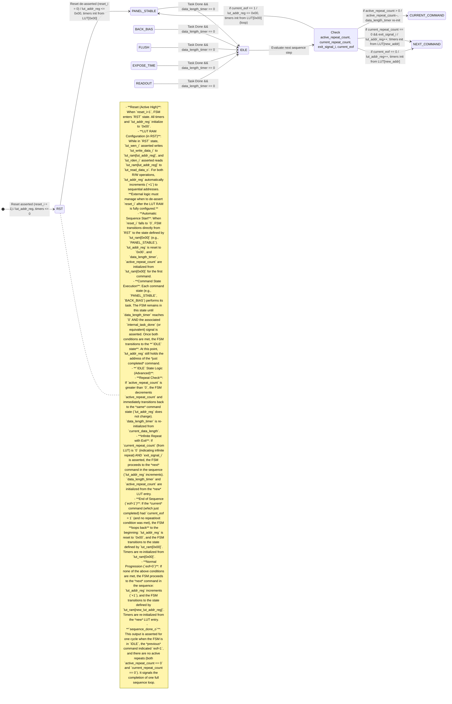

```mermaid
stateDiagram-v2
    direction LR
    state RST
    state IDLE
    state PANEL_STABLE : panel_enable_o=1, bias_enable_o=0, flush_enable_o=0, expose_enable_o=0, readout_enable_o=0, aed_enable_o=0
    state BACK_BIAS : panel_enable_o=0, bias_enable_o=1, flush_enable_o=0, expose_enable_o=0, readout_enable_o=0, aed_enable_o=0
    state FLUSH : panel_enable_o=0, bias_enable_o=0, flush_enable_o=1, expose_enable_o=0, readout_enable_o=0, aed_enable_o=0
    state AED_DETECT : panel_enable_o=0, bias_enable_o=0, flush_enable_o=0, expose_enable_o=0, readout_enable_o=0, aed_enable_o=1
    state EXPOSE_TIME : panel_enable_o=0, bias_enable_o=0, flush_enable_o=0, expose_enable_o=1, readout_enable_o=0, aed_enable_o=0
    state READOUT : panel_enable_o=0, bias_enable_o=0, flush_enable_o=0, expose_enable_o=0, readout_enable_o=1, aed_enable_o=0

    [*] --> RST : Reset asserted (reset_i = 1) / lut_addr_reg, timers <= 0
    RST --> PANEL_STABLE : Reset de-asserted (reset_i = 0) / lut_addr_reg <= 0x00, timers init from LUT[0x00]
    PANEL_STABLE --> IDLE : Task Done && data_length_timer == 0
    BACK_BIAS --> IDLE : Task Done && data_length_timer == 0
    FLUSH --> IDLE : Task Done && data_length_timer == 0
    EXPOSE_TIME --> IDLE : Task Done && data_length_timer == 0
    READOUT --> IDLE : Task Done && data_length_timer == 0
    IDLE --> IDLE_Check_Repeat : Evaluate next sequence step
    IDLE_Check_Repeat : Check active_repeat_count, current_repeat_count, exit_signal_i, current_eof
    IDLE_Check_Repeat --> CURRENT_COMMAND : if active_repeat_count > 0 / active_repeat_count--, data_length_timer re-init
    IDLE_Check_Repeat --> NEXT_COMMAND : if current_repeat_count == 0 && exit_signal_i / lut_addr_reg++, timers init from LUT[new_addr]
    IDLE_Check_Repeat --> PANEL_STABLE : if current_eof == 1 / lut_addr_reg <= 0x00, timers init from LUT[0x00] (loop)
    IDLE_Check_Repeat --> NEXT_COMMAND : if current_eof == 0 / lut_addr_reg++, timers init from LUT[new_addr]

    note right of RST
        - **Reset (Active High)**: When `reset_i=1`, FSM enters `RST` state. All timers and `lut_addr_reg` initialize to `0x00`.
        - **LUT RAM Configuration (in RST)**: While in `RST` state, `lut_wen_i` asserted writes `lut_write_data_i` to `lut_ram[lut_addr_reg]`, and `lut_rden_i` asserted reads `lut_ram[lut_addr_reg]` to `lut_read_data_o`. For both R/W operations, `lut_addr_reg` automatically increments (`+1`) to sequential addresses. **External logic must manage when to de-assert `reset_i` after the LUT RAM is fully configured.**
        - **Automatic Sequence Start**: When `reset_i` falls to `0`, FSM transitions directly from `RST` to the state defined by `lut_ram[0x00]` (e.g., `PANEL_STABLE`). `lut_addr_reg` is reset to `0x00`, and `data_length_timer`, `active_repeat_count` are initialized from `lut_ram[0x00]` for the first command.
        - **Command State Execution**: Each command state (e.g., `PANEL_STABLE`, `BACK_BIAS`) performs its task. The FSM remains in this state until `data_length_timer` reaches `0` AND the associated `internal_task_done` (or equivalent) signal is asserted. Once both conditions are met, the FSM transitions to the **`IDLE` state**. At this point, `lut_addr_reg` still holds the address of the *just completed* command.
        - **`IDLE` State Logic (Advanced)**:
            - **Repeat Check**: If `active_repeat_count` is greater than `0`, the FSM decrements `active_repeat_count` and immediately transitions back to the *same* command state (`lut_addr_reg` does not change). `data_length_timer` is re-initialized from `current_data_length`.
            - **Infinite Repeat with Exit**: If `current_repeat_count` (from LUT) is `0` (indicating infinite repeat) AND `exit_signal_i` is asserted, the FSM proceeds to the *next* command in the sequence (`lut_addr_reg` increments). `data_length_timer` and `active_repeat_count` are initialized from the *new* LUT entry.
            - **End of Sequence (`eof=1`)**: If the *current* command (which just completed) had `current_eof = 1` (and no repeat/exit condition was met), the FSM **loops back** to the beginning: `lut_addr_reg` is reset to `0x00`, and the FSM transitions to the state defined by `lut_ram[0x00]`. Timers are re-initialized from `lut_ram[0x00]`.
            - **Normal Progression (`eof=0`)**: If none of the above conditions are met, the FSM proceeds to the *next* command in the sequence: `lut_addr_reg` increments (`+1`), and the FSM transitions to the state defined by `lut_ram[new_lut_addr_reg]`. Timers are re-initialized from the *new* LUT entry.
        - **`sequence_done_o`**: This output is asserted for one cycle when the FSM is in `IDLE`, the *previous* command indicated `eof=1`, and there are no active repeats (both `active_repeat_count == 0` and `current_repeat_count == 0`). It signals the completion of one full sequence loop.
    end note
```