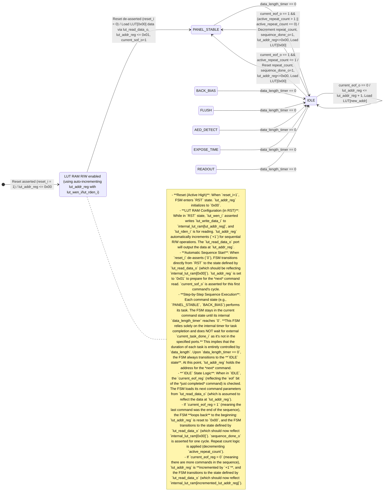

```mermaid
stateDiagram-v2
    direction LR
    state RST
    state IDLE
    state PANEL_STABLE : panel_enable_o=1
    state BACK_BIAS : bias_enable_o=1
    state FLUSH : flush_enable_o=1
    state AED_DETECT
    state EXPOSE_TIME : expose_enable_o=1
    state READOUT : readout_enable_o=1, aed_enable_o=1


    [*] --> RST : Reset asserted (reset_i = 1) / lut_addr_reg <= 0x00
    RST --> PANEL_STABLE : Reset de-asserted (reset_i = 0) / Load LUT[0x00] data via lut_read_data_o, lut_addr_reg <= 0x01, current_sof_o=1
    RST : LUT RAM R/W enabled (using auto-incrementing lut_addr_reg with lut_wen_i/lut_rden_i)
    PANEL_STABLE --> IDLE : data_length_timer == 0
    BACK_BIAS --> IDLE : data_length_timer == 0
    FLUSH --> IDLE : data_length_timer == 0
    AED_DETECT --> IDLE : data_length_timer == 0
    EXPOSE_TIME --> IDLE : data_length_timer == 0
    READOUT --> IDLE : data_length_timer == 0
    IDLE --> PANEL_STABLE : current_eof_o == 1 && (active_repeat_count > 1 || active_repeat_count == 0) / Decrement repeat_count, sequence_done_o=1, lut_addr_reg<=0x00, Load LUT[0x00]
    IDLE --> PANEL_STABLE : current_eof_o == 1 && active_repeat_count == 1 / Reset repeat_count, sequence_done_o=1, lut_addr_reg<=0x00, Load LUT[0x00]
    IDLE --> IDLE : current_eof_o == 0 / lut_addr_reg <= lut_addr_reg + 1, Load LUT[new_addr]

    note right of RST
        - **Reset (Active High)**: When `reset_i=1`, FSM enters `RST` state. `lut_addr_reg` initializes to `0x00`.
        - **LUT RAM Configuration (in RST)**: While in `RST` state, `lut_wen_i` asserted writes `lut_write_data_i` to `internal_lut_ram[lut_addr_reg]`, and `lut_rden_i` is for reading. `lut_addr_reg` automatically increments (`+1`) for sequential R/W operations. The `lut_read_data_o` port will output the data at `lut_addr_reg`.
        - **Automatic Sequence Start**: When `reset_i` de-asserts (`0`), FSM transitions directly from `RST` to the state defined by `lut_read_data_o` (which should be reflecting `internal_lut_ram[0x00]`). `lut_addr_reg` is set to `0x01` to prepare for the *next* command read. `current_sof_o` is asserted for this first command's cycle.
        - **Step-by-Step Sequence Execution**: Each command state (e.g., `PANEL_STABLE`, `BACK_BIAS`) performs its task. The FSM stays in the current command state until its internal `data_length_timer` reaches `0`. **This FSM relies solely on the internal timer for task completion and does NOT wait for external `current_task_done_i` as it's not in the specified ports.** This implies that the duration of each task is entirely controlled by `data_length`. Upon `data_length_timer == 0`, the FSM always transitions to the **`IDLE` state**. At this point, `lut_addr_reg` holds the address for the *next* command.
        - **`IDLE` State Logic**: When in `IDLE`, the `current_eof_reg` (reflecting the `eof` bit of the *just completed* command) is checked. The FSM loads its next command parameters from `lut_read_data_o` (which is assumed to reflect the data at `lut_addr_reg`).
            - If `current_eof_reg = 1` (meaning the last command was the end of the sequence), the FSM **loops back** to the beginning: `lut_addr_reg` is reset to `0x00`, and the FSM transitions to the state defined by `lut_read_data_o` (which should now reflect `internal_lut_ram[0x00]`). `sequence_done_o` is asserted for one cycle. Repeat count logic is applied (decrementing `active_repeat_count`).
            - If `current_eof_reg = 0` (meaning there are more commands in the sequence), `lut_addr_reg` is **incremented by `+1`**, and the FSM transitions to the state defined by `lut_read_data_o` (which should now reflect `internal_lut_ram[incremented_lut_addr_reg]`).
    end note
```