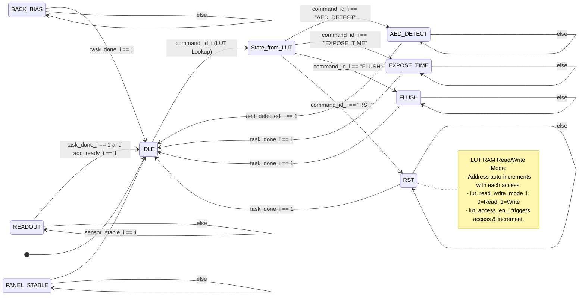

```mermaid
stateDiagram-v2
    direction LR
    state IDLE
    state RST
    state BACK_BIAS
    state FLUSH
    state EXPOSE_TIME
    state READOUT
    state AED_DETECT
    state PANEL_STABLE

    [*] --> IDLE
    IDLE --> State_from_LUT : command_id_i (LUT Lookup)
    state State_from_LUT <<choice>>
    State_from_LUT --> AED_DETECT : command_id_i == "AED_DETECT"
    State_from_LUT --> EXPOSE_TIME : command_id_i == "EXPOSE_TIME"
    State_from_LUT --> FLUSH : command_id_i == "FLUSH"
    State_from_LUT --> RST : command_id_i == "RST"

    RST --> IDLE : task_done_i == 1
    RST --> RST : else
    BACK_BIAS --> IDLE : task_done_i == 1
    BACK_BIAS --> BACK_BIAS : else
    FLUSH --> IDLE : task_done_i == 1
    FLUSH --> FLUSH : else
    EXPOSE_TIME --> IDLE : task_done_i == 1
    EXPOSE_TIME --> EXPOSE_TIME : else
    READOUT --> IDLE : task_done_i == 1 and adc_ready_i == 1
    READOUT --> READOUT : else
    AED_DETECT --> IDLE : aed_detected_i == 1
    AED_DETECT --> AED_DETECT : else
    PANEL_STABLE --> IDLE : sensor_stable_i == 1
    PANEL_STABLE --> PANEL_STABLE : else

    note right of RST
        LUT RAM Read/Write Mode:
        - Address auto-increments with each access.
        - lut_read_write_mode_i: 0=Read, 1=Write
        - lut_access_en_i triggers access & increment.
    end note
```